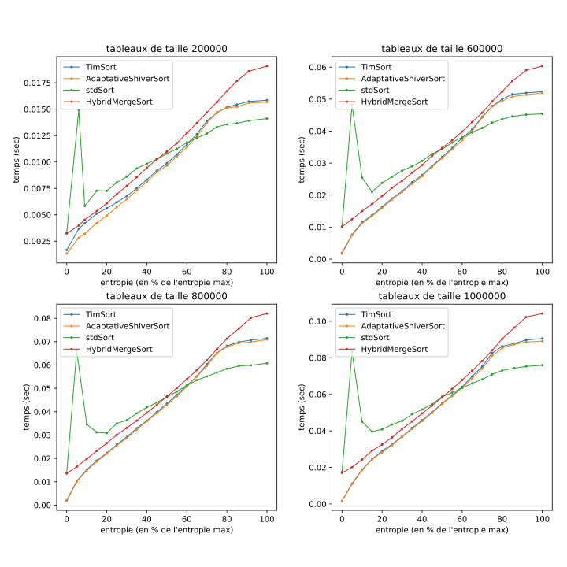

# PSTL-Tri-optimise

Test et implémentation de plusieurs algorithmes de tri en vue de trouver un
successeur au TimSort.

En comparant Adaptative Shiver Sort avec d'autres algorithmes, on peut voir que ses performances sont tout à fait honorables.
On remarque en effet que l’algorithme AdaptiveShiverSort suit de très près les performances de l’algorithme Tim Sort (avec un léger avantage pour l’AdaptiveShiverSort) ce qui peut s’expliquer par leur grande similarité en termes de stratégie de fusion des runs.

Ce test a été fait sur la configuration suivante :
```
Nom du modèle :             MacBook Pro (13-inch, 2018, Four Thunderbolt 3 Ports)
Système d’exploitation :    MacOS 10.14.1 (18B75)
C++ version :               4.2.1
Nom du processeur :         Intel(R) Core(TM) i5-8259U CPU @ 2.30GHz 64bit
       L1d cache:   32K
       L1i cache:   32K
       L2 cache:    262K
       L3 cache:    6291K
Nombre de processeurs :     1
Nombre total de coeurs :    4
Mémoire (RAM) :             8 Go
```
Pour avoir plus de précision sur les comparaisons entre les algorithmes ainsi que leur fonctionnement et leur implémentation, vous pouvez consulter le fichier [Rapport_final_pinto_dutra.pdf](Rapport_final_pinto_dutra.pdf).

Pour lancer toute la chaine de tests, executer `whole_execution.bash`


## Utilisation de array_generator_config.json

**Méthodes de génération de listes :**
- alea *(= entropie max)*
- entropie_alea
- run_constant_croiss_lineaires 
- run_alea *(doit quand meme donner un nombre de runs)*
- run_delta 
- run_delta_with_unsorted *(certains runs sont non triés)*
- nb_runs_given_by_entropy *(tous les runs ont la meme taille)*

**Variables de taille liste :**
- nbrep = nombre de répétition pour chaque configuration de liste
- t = taille de la liste précédente (taille début pour la première)
- tf = taille_fin
- td = taille_départ
- nb = nombre total de listes (hors répétitions)
- n = numéro de liste (hors répétitions)

**Variables de nombre de runs :**
- *toutes les variables de taille de liste*
- nbr = nombre de runs du precedent calcul (nb_runs_depart pour le premier)
- nbrf = nb_runs_fin
- nbrd = nb_runs_depart

**Variable entropie :**
- la = entropie de l'itération précédente (0 à la 1ère itération)
- rep = nième répétition (en partant de 0)


## Utilisation de generateur_graphique.py

```
   Usage: $ generateur_graphique.py param_1 [param_n] [-s --size]
 
   * param_1: name of a graphic you want
   * ...
   * param_n: name of a graphic you want
 
   * -s / --size integer_1 ... integer_n : all list size you want to display

   * -i / --intervale_entro integer_1 integer_2 : the interval of entropi you want to display
                                                  (only for temps/taille_box graph)

```

Voici les différents types de graphiques disponibles :
- **temps/taille** *-> en courbes*\
  **temps/taille_box** *-> en boite à moustache*\
  x = taille\
  y = temps execution
- **temps/entropie** *-> en boite à moustache*\
  **new_temps/entropie_courbes** *-> en courbes*\
  x = valeur entropie\
  y = temps execution
- **heatmap**\
  -> pout chaque algo :\
  x = taille liste\
  y = entropie (en % de 0 à 1 avec 1 l'entropie maximum parmis toutes les heatmaps)\
  z = temps d'execution

Exemple : 
```BASH
$ python3 generateur_graphique.py heatmap temps/taille`
```

## Requirements

- CMake version >= 3.15
- Librairie de micro-benchmarking de Google :
  https://github.com/google/benchmark


## Build

Lancer `make`, les exécutables générés se trouvent dans le dossier `build`
